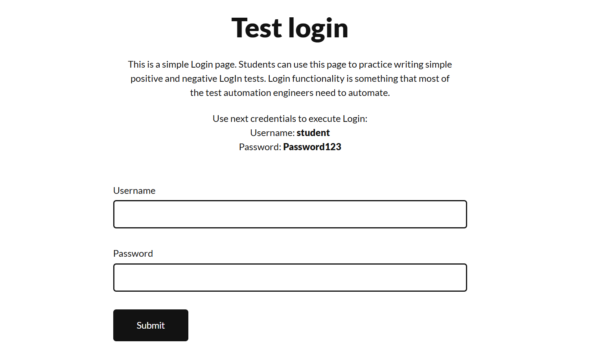
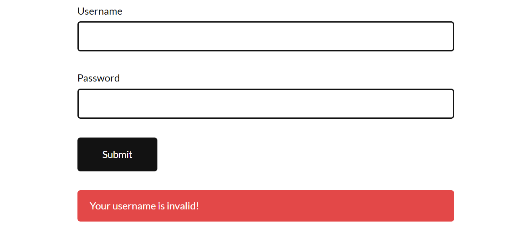

# Manual Testing Practice Project

This repository showcases my manual testing work on a login web application.

### Key Highlights:
- Designed and executed 10+ test cases
- Identified and reported bugs with severity levels
- Performed functional, exploratory, and UI testing
- Documented results using Excel and screenshots
## Website Tested
https://practicetestautomation.com/practice-test-login/

## Objective
To perform manual testing on a login web application.

## Testing Types
- Functional Testing
- Exploratory Testing
- UI Testing

## Test Cases
- Created 10 test cases for login functionality

## Bug Reports
- Identified usability and UI-related issues

## Tools Used
- Excel
## Screenshots

## Outcome
Learned how to design test cases and report bugs
=======
# manual-testing-project
