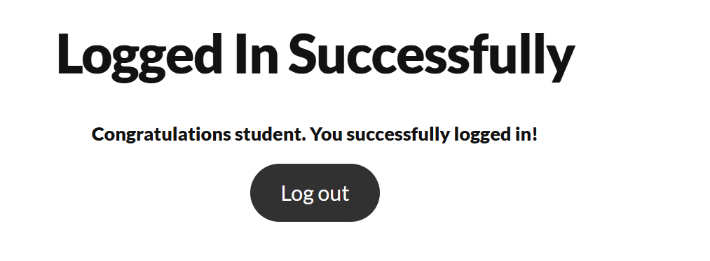
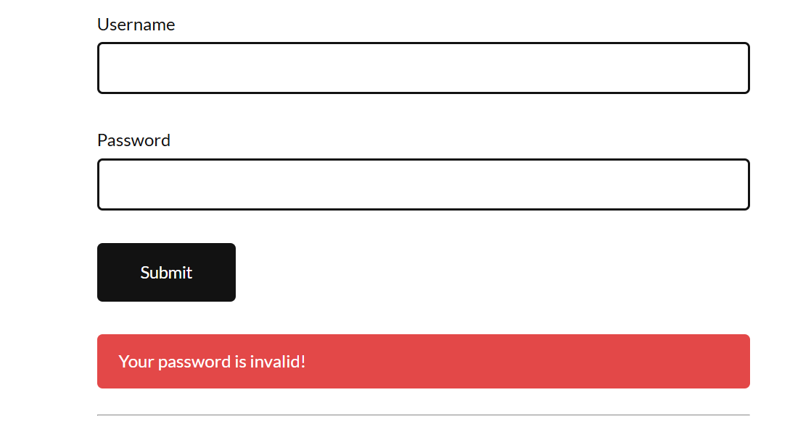
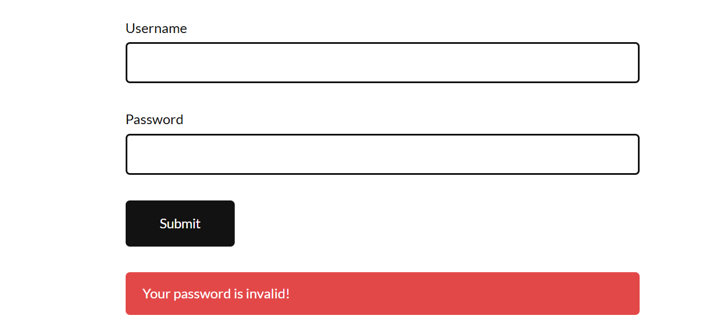
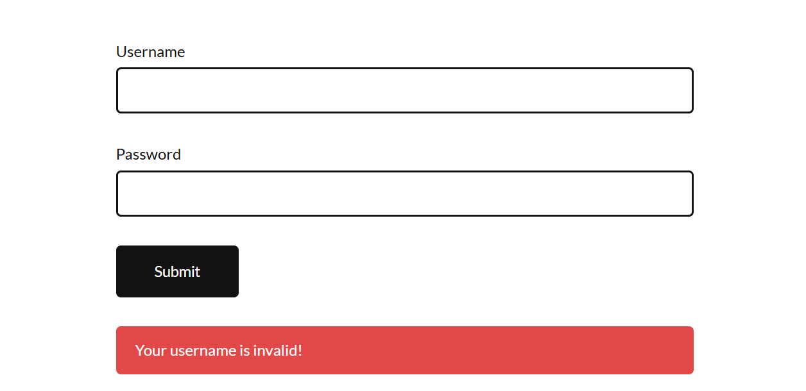

# Manual Testing Practice Project

## Website Tested
https://practicetestautomation.com/practice-test-login/

## Objective
To perform manual testing on a login web application.

## Testing Types
- Functional Testing
- Exploratory Testing
- UI Testing

## Test Cases
- Created 10 test cases for login functionality

## Bug Reports
- Identified usability and UI-related issues

## Tools Used
- Excel
## Screenshots

## Outcome
Learned how to design test cases and report bugs
=======
# manual-testing-project
